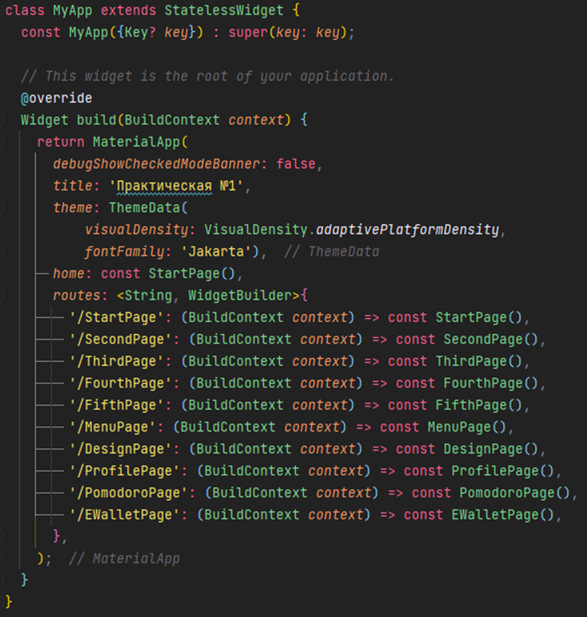

# Практическая работа №1

## Тема: Создание экранов при помощи Flutter.

### Цель работы: в ходе выполнения практической работы создать 5 сэкранов на Flutter для мобильных телефонов.

### Ход работы:

1. __Докачивание библиотек__

    Для начала в файле `pubspec.yaml` установим две библиотеки:

   - `flutter_svg` - позволяет использовать виджет `SvgPicture` для вывода векторных изображений;
   - `google_fonts` - позволяет с помощью класса `GoogleFonts` использовать шрифты из библиотеки шрифтов *Google*;

2. __Настройка главного класса__
    
    Далее в файле `main.dart` в галвном классе `MyApp` настраиваем виджет `MaterialApp` следующим образом:

    

    С помощью параметра *routes* указываем все возможные маршруты для навигации по экранам.

3. __Создание макетов.__

    Для вывода всех вариантов еды использовался `ListView.builder` и класс `Food` с уже готовым списком еды. 
    
   Также для удобства создания стилей для виджетов был создан файл `constants.dart`, в котором хранятся значения цветов для каждого экрана.

    В пятом окне для вывода истории транзакций также использовался `ListView.builder` и класс `Transaction` с уже созданным списком транзакций.

    Для создания макетов были использованы следующие виджеты и классы:

    - `SafeArea` - позволяет сделать верхний отступ, чтобы контент не пересекался с элементами на экране телефона.
    
    - `Scaffold` - позволяет настроить верхнюю панель, нижнюю панель, главный контет и т.д.

    - `SingleChildScrollView` - позволяет сделать дочерний виджет прокручиваемым.

    - `Column` - позволяет выводить дочерние виджеты в одну колонку.

    - `Stack` - позволяет накладывать дочерние виджеты друг на друга.

    - `Image` - позволяет выводить изображения.

    - `Positioned` - позволяет настроить расположение виджета в родительском виджете Stack.

    - `Align` - позволяет выровнить виджет.

    - `Container` - позволяет настроить пространство вокруг дочернего виджета.

    - `BoxDecoration` - класс со стилями для Container.

    - `BorderRadius` - класс, позволяющий настроить сглаживание углов у Container.

    - `Border` - класс, позволяющий настроить границы Container.

    - `Color` - класс, позволяющий задать цвет.

    - `FloatingActionButton` - круглая кнопка с иконкой внутри.

    - `SvgPicture` - импортированный виджет, позволяющий отображать svg файлы.

    - `Text` - позволяет вывести текст.

    - `OutlinedButton` - кнопка с границами и без фона.

    - `Padding` - позволяет задать отступы для дочернего виджета.

    - `Row` - позволяет выводить дочерние виджеты в одну строку.

    - `CrossAxisAligment` - класс, позволяющий настроить выравнивание дочерних элементов по второстепенной оси.

    - `SizedBox` - прозрачный контейнер, позволяющий сделать отступ с фиксированной высотой или шириной.

    - `EdgeInsets` - класс, позволяющий настроить отступы.

    - `ElevatedButton` - кнопка с фоном.

    - `RoundedRectangleBorder` - класс фигуры прямоугольника с закругленными углами.

    - `MainAxisAlignment` - класс, позволяющий настроить выравнивание дочерних элементов по основной оси.

    - `IconButton` - кнопка, похожая на FAB, но не имеющая фона.

    - `Expanded` - позволяет дочернему виджету заполнить все свободное пространство.

    - `Navigator` - класс, позволяющий производить навигацию между роутами, указанными в главном классе.

    - `Center` - позволяет выровнить дочерний элемент строго по центру.

###Вывод: в ходе выполнения практической работы были созданы 5 экранов на *Flutter* для мобильных телефонов.